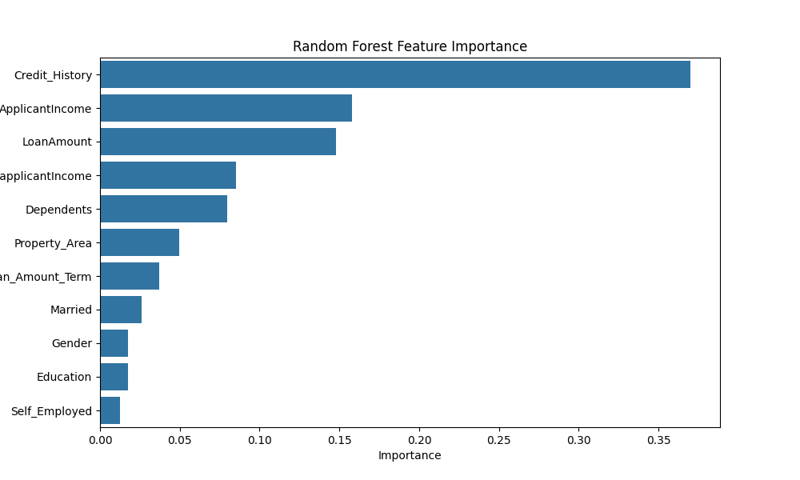
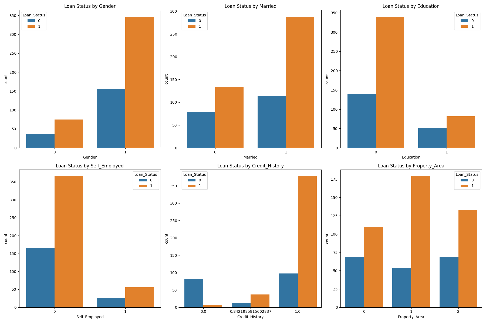

# Loan Approval Prediction with Random Forest

## Overview

This project uses the Random Forest machine learning algorithm to predict whether a loan application should be approved or rejected. By analyzing applicant information such as credit history, income, and employment, the model identifies patterns to make a confident decision. The use of a Random Forest, an ensemble learning method, ensures a robust and highly accurate model by combining the predictive power of multiple individual decision trees.

## Features

- Data Preprocessing: Cleans and prepares the dataset, handling missing values and converting categorical features to a numerical format suitable for the model.

- Feature Importance: Visualizes and quantifies which features (e.g., credit history, income) are most influential in the model's decision-making process.Model Training: Trains a RandomForestClassifier on the processed data.

- Hyperparameter Tuning: Explores key hyperparameters such as the number of trees (n_estimators) and the maximum depth of each tree (max_depth) to optimize model performance.

- Evaluation: Provides a detailed Classification Report and Confusion Matrix to assess the model's performance, with a special focus on the F1-Score, a crucial metric for this type of problem where misclassifying a "bad" loan is more costly than a "good" one.

## Technologies Used

- Python: The core programming language.

- pandas: For efficient data manipulation and analysis.

- scikit-learn: For implementing the Random Forest algorithm, preprocessing steps, and evaluation metrics.

- matplotlib & seaborn: For creating informative plots and visualizations, particularly for feature importance.

## Data Analysis & Processing

The project uses the Loan Prediction dataset. The initial steps involve:Loading the dataset from a public URL.Handling missing values by filling them with the mode for categorical features and the mean for numerical features.Encoding categorical variables (e.g., Gender, Married, Education) into a numerical format using one-hot encoding.Splitting the data into a training set and a testing set to evaluate the model on unseen data.

## Model Used

The primary model is the Random Forest Classifier. This algorithm works by creating a "forest" of multiple decision trees. Each tree is trained on a random subset of the data and a random subset of features. The final prediction is determined by a majority vote from all the trees, which significantly reduces the risk of overfitting and improves accuracy.

## How to Run the Project

1. Clone the repository:

```bash
git clone <https://github.com/sjain2580/Loan-Approval-Prediction-with-Random-Forest>
cd <repository_name>
```

2. Create and activate a virtual environment (optional but recommended):python -m venv venv

- On Windows:
  
```bash
.\venv\Scripts\activate
```

- On macOS/Linux:

```bash
source venv/bin/activate
```

3. Install the required libraries:

```bash
pip install -r requirements.txt
```

4. Run the Script:

```bash
python prediction.py
```

4. Run the App locally:

```bash
streamlit run app.py
```

## Visualization

The project includes a visualization of Feature Importance to help understand which factors most influence the model's decisions. This helps in gaining business insights from the model.




## Live deployment
Check the live app here: <>

## Contributors

**<https://github.com/sjain2580>**
Feel free to fork this repository, submit issues, or pull requests to improve the project. Suggestions for model enhancement or additional visualizations are welcome!

## Connect with Me

Feel free to reach out if you have any questions or just want to connect!
**[](https://www.linkedin.com/in/sjain04/)**
**[](https://github.com/sjain2580)**
**[](mailto:sjain040395@gmail.com)**

---
